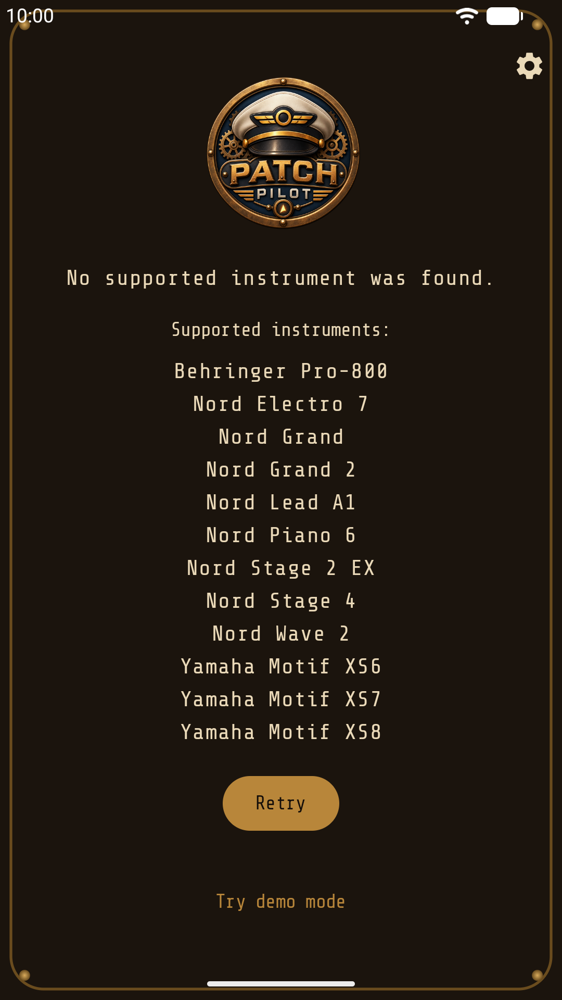
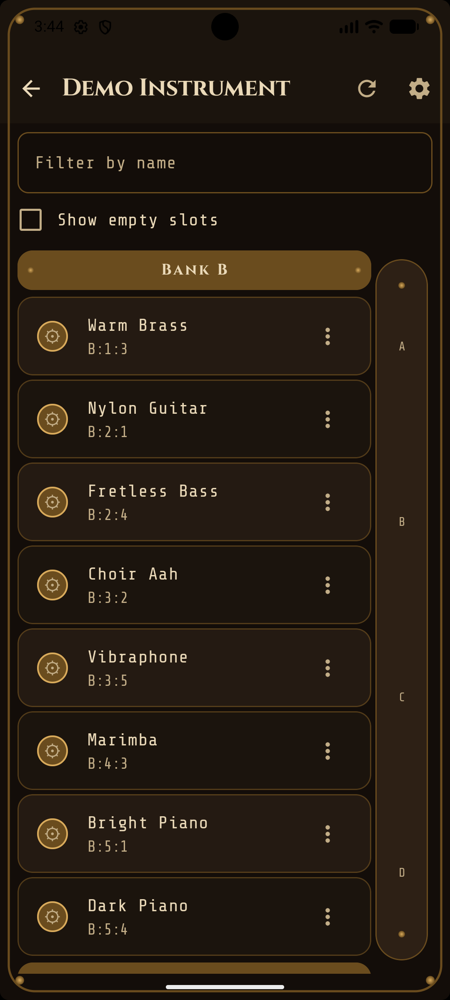
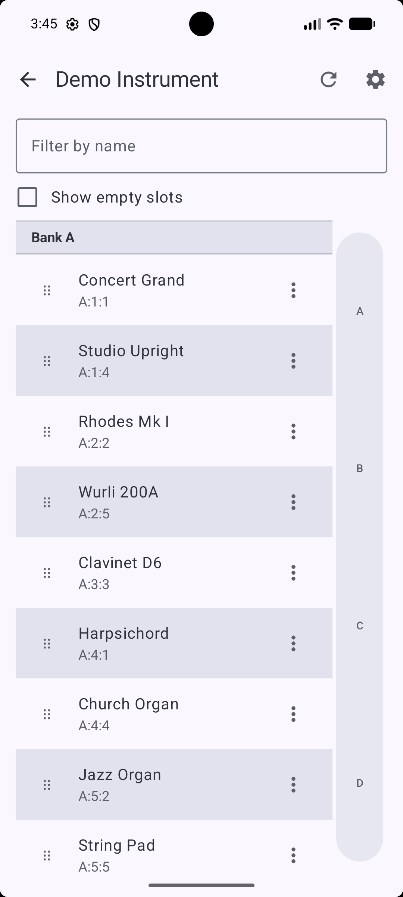

# PatchPilot

PatchPilot is a native Android app for browsing, organizing, and editing presets on hardware synthesizers over USB — renaming, copying, moving, and deleting presets directly from your phone or tablet, without needing a computer or the manufacturer's own editor software.

## Supported instruments

- Nord Grand
- Nord Grand 2
- Nord Stage 2EX
- Nord Stage 4
- Nord Electro 7
- Nord Piano 6
- Nord Lead A1
- Nord Wave 2
- Behringer Pro-800
- Yamaha Motif XS6/XS7/XS8 (only the XS6 tested against real hardware; XS7/XS8 USB product IDs are inferred from Yamaha's driver files and sequential-PID precedent, not yet confirmed on an actual unit)

Each instrument connects over USB (directly, or via USB-MIDI where the instrument supports it).

### Will PatchPilot support other Nord instruments automatically?

Likely, for another instrument in the same Nord/Clavia protocol family — this has already happened six times since the original two (Nord Stage 2EX and Nord Grand). Every Nord model above shares a single protocol implementation in this app; every behavioral difference between them is expressed as data — a device-catalog entry — rather than device-specific code. Adding a further Nord instrument that speaks the same USB protocol is expected to require only a new catalog entry (vendor/product id, bank layout, supported firmware), not new protocol code. Note that for safety reasons, a new firmware version will report a warning as it cannot be guaranteed that the instrument behavior will be the same. It will not prevent you from using the app, though.

The app allows using unsupported Nord devices (with a warning). There is a debug menu (5 taps on the instrument name in the preset view to open), that allows you to run a regression test and share the report. Send it to me to add the instrument.

### Will PatchPilot support other instruments?

The generalization of the connection protocols does not extend across vendors. Behringer Pro-800 and Yamaha Motif XS each required an independent, from-scratch protocol implementation, and nothing about either implies support for other instruments from those manufacturers — a further Behringer or Yamaha instrument would need its own implementation, verified against real hardware, just as these two did.

I'll be adding more instruments when I get my hands on them (I have some still in the pipeline) and if they provide enough of a connection surface to allow reliable use of the app. In case you have specific requests, let me know and I'll see what I can do.

## Screenshots

As you can see, the app exists in two themes. More might follow if I'm feeling inspired.

<p>
  
  
  
</p>

## Building

```
cd android
./gradlew assembleDebug
```

Unit tests:

```
cd android
./gradlew testDebugUnitTest
```

The build reads the device catalog from `../devices` relative to `android/` (JSON descriptors and binary fixtures used to generate the app's USB device filter and asset bundle) — keep the `devices/` and `android/` directories as siblings.

### Continuous integration

[GitHub Actions](.github/workflows/android.yml) runs the unit tests and `assembleRelease bundleRelease` on every pull request and on every push to `main`. Pushes to `dev` or to a feature branch without a pull request do not trigger a build. A failing test or build fails the run, and the test reports are then attached to it as an artifact.

On `main` the release APK and bundle are signed with the release key, held in repository secrets (see [RELEASING.md](docs/RELEASING.md#signing)), and attached to the run as an artifact for 30 days. Pull-request builds are unsigned.

See [ARCHITECTURE.md](docs/ARCHITECTURE.md) for a tour of the codebase and [PROTOCOLS.md](docs/PROTOCOLS.md) for the wire protocols each device implementation uses, and [RELEASING.md](docs/RELEASING.md) for how a version is published.

## Legal

Patch Pilot collects no data and has no network access - see [PRIVACY.md](PRIVACY.md).

PatchPilot is an independent, unofficial project. It is not affiliated with, endorsed by, or supported by Clavia DMI AB (Nord), Music Tribe / Behringer, or Yamaha Corporation. Product and brand names are used solely to identify the hardware this app is compatible with.

This software interacts with your instrument's internal storage, including operations that overwrite or delete presets. It is provided "AS IS", without warranty of any kind, as permitted by the license below. Use with real hardware is at your own risk.

## License

PatchPilot is licensed under the GNU General Public License v3.0 (SPDX: `GPL-3.0-only`) — see [LICENSE](LICENSE). Third-party license notices for bundled dependencies and fonts are listed in [android/NOTICE.md](android/NOTICE.md).

## Thank You

Thanks to both my bands [The Wolfwalk Experience](https://www.youtube.com/@thewolfwalkexperience) and [The Jukes](https://www.youtube.com/@thejukesmusicgermany) without whom I'd never have started this project. Go and give them a listen!