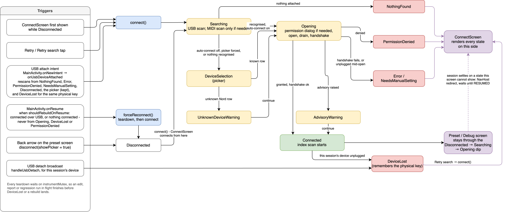

# Architecture

Patch Pilot is a native Android app for browsing, organizing and editing presets on supported hardware synthesizers over USB. It is a thin client: there is no server and no account system. The only state persisted across launches is the theme choice and the auto-connect preference; everything else lives on the connected instrument or in memory for the life of the process.

## Package layout

All source lives under `de.thewolfwalkexperience.software.patchpilot`.

| Package | Responsibility |
|---|---|
| `core/` | Device-agnostic domain model. The `Instrument` interface is the central abstraction the rest of the app is built around. Also `RegressionTester`, the facet-driven self-test behind the debug menu. |
| `transport/` | Byte-level I/O. `Transport` and its `AndroidUsbBulkTransport`, `AndroidMidiTransport` and `UsbMidiBulkTransport` implementations carry bytes with no protocol knowledge, so device code can be tested without hardware. |
| `midi/` | SysEx message framing (`SysExFramer`) and request/response correlation (`SysExExchange`), shared by the two families that speak SysEx (Pro-800, Motif XS). |
| `discovery/` | Finds candidate instruments on the USB host bus and through Android's MIDI service, and merges them into one deduplicated list. |
| `catalog/` | Loads the per-family JSON device descriptors and maps a discovered device to the family implementation that handles it. |
| `devices/nord/`, `devices/pro800/`, `devices/motifxs/` | One protocol implementation per device family, each adapting its wire protocol onto `core.Instrument`. |
| `demo/` | An in-memory instrument for exploring the UI without hardware. |
| `usb/` | Android USB host APIs: device enumeration, runtime permission and interface claiming. |
| `cache/` | An in-memory decorator that keeps a completed preset listing across the reconnects the app performs on every return to the foreground. |
| `ui/` | Jetpack Compose screens, one shared ViewModel, and navigation. |
| `ui/theme/` | The theme system: Material 3 following the system setting, an alternate "Steampunk" skin, and the seam screens use to draw themselves differently per theme. |

## The `Instrument` abstraction

`core.Instrument` is an interface with a mandatory `browser` facet (list and re-read presets) and optional, nullable facets: `selector` (load a preset), `editor` (rename, move, swap, delete, copy), `transfer` (read and write a preset's raw data), `report` (a read-only device report) and `tagger` (categories and favorites). A family implements only the facets its instrument supports, and the UI checks for a facet's presence rather than catching an "unsupported operation" exception. Nullability makes the check and the capability the same piece of information: there is no separate capability set that could drift from what is implemented.

The abstraction sits above the wire-message level: the UI consumes "a list of named, addressable slots", not the shape of any device's messages. There is no shared message or plugin type across families. A CRC-framed bulk protocol (Nord), a SysEx stream over class-compliant MIDI (Pro-800) and a SysEx stream over raw bulk (Motif XS) have no useful common representation below the operation level.

Related types:

- `SlotAddress`: a canonical 0-based `(bank, slot)` pair, with a per-family `AddressFormat` responsible for rendering and parsing that family's own id shape (`A:1:1` on a Nord, `A00` on a Pro-800, `USER 1 - A:01` on a Motif XS). The UI never parses an id string itself; `PresetSlot` carries its display id and bank label.
- `SlotLayout` and `BankSpec`: the instrument's addressable preset space. `BankSpec.readOnly` lives on the layout rather than on each row, so which addresses a copy may target and which rows offer an edit derive from one field.
- `IndexUpdate` and `Flow<IndexUpdate>`: listing is a stream, not a single suspending call, because the Pro-800 and the Motif XS have no directory and must be read slot by slot to learn each preset's name. Rows appear as they arrive; one unreadable slot is reported as `IndexUpdate.Failed` and does not abort the walk. `indexWalk` in `core/` is the shared loop.
- `InstrumentException`: a sealed hierarchy the UI branches on by type, never by message text. `BlockedByDeviceState` carries an optional remedy the app can apply after asking (a Motif XS in Performance mode ignores a voice selection; the remedy switches it to Voice mode). `NeedsManualSetting` carries the steps for a fix only the user can make at the instrument's panel (a Motif XS routing MIDI to its DIN ports instead of USB).
- `PresetTagger`: categories and favorites, shaped for both a Nord program (one category, no sub-categories, no favorites) and a Motif XS voice (two assignments of main plus sub-category, and a favorite mark that names which of them the instrument files the voice under).

## Transport and discovery

`transport.Transport` is the shared marker interface with two specializations: `UsbBulkTransport` (paired bulk endpoints plus the control pipe, implemented by `AndroidUsbBulkTransport`) and `MidiTransport` (a MIDI byte stream in and out, implemented by `AndroidMidiTransport` over `android.media.midi` and by `UsbMidiBulkTransport`, which packs USB-MIDI event packets by hand over a raw bulk endpoint for a device with no class-compliant MIDI interface). Device code depends only on these interfaces, so protocol logic is unit-tested against scripted fakes with no hardware or emulator.

`discovery.DeviceDiscovery` has one implementation per bus. `UsbHostDiscovery` matches USB vendor and product ids against the catalog. `MidiDiscovery` never matches on port name; it identifies a port by sending the read-only, idempotent probe the catalog declares and checking the reply. `mergeCandidates` keeps one entry per physical device, USB host first, because a Nord also exposes a class-compliant MIDI interface that cannot manage presets.

`InstrumentViewModel.performConnect` reads `ConnectionPreferences.autoConnectToFirstFound` (Preferences DataStore, default true) on every scan. On, it scans the USB bus first and, if that alone already found a recognised instrument, connects to it without running the MIDI scan at all — `mergeCandidates` would always prefer that USB candidate over a MIDI one for the same physical device anyway, so the MIDI scan could not change the outcome, and skipping it is what keeps a Nord's launch fast now that MIDI-only families exist. Off, or where USB alone found nothing recognised, it falls through to the full two-bus scan and either connects to the first result or, with auto-connect off, always stops at `ConnectionState.DeviceSelection` so the user picks explicitly.

## Catalog and adding a device family

Each family is described by one JSON file under `devices/` (see [devices/README.md](../devices/README.md)). `InstrumentRegistry` is a compile-time list of families, each of which loads its own catalog and builds its `Instrument` on an opened transport. `res/xml/device_filter.xml`, which Android reads to launch the app when a matching USB device is attached, is generated from the catalogs' USB ids by a Gradle task before every build. Unlike the copied assets, the generated file is committed, so the manifest's reference to it resolves in a fresh checkout before the first build; the task overwrites it whenever the catalog changes.

Adding a device that speaks an already-implemented family's protocol is a catalog entry. Adding a new protocol is a new package under `devices/` implementing at least `Instrument.browser`, plus one entry in `InstrumentRegistry`.

`catalog.UnknownDevicePolicy` decides whether an unrecognized USB device may be opened on a guess against a known family's protocol. The families that allow it are a hardcoded set, currently the Nord family alone; the rule behind that choice is that a guess is only defensible where at least two verified members of the family share one protocol. The Pro-800 and the Motif XS families each have one verified member, which is no evidence about other instruments from the same vendor, so their vendor ids are refused. The vendor ids themselves are read from the catalog, so a new Nord model needs no change here.

### Nord family scope

Every supported Nord model (eight in the catalog) shares one implementation, `devices/nord/NordDevice.kt` and `NordInstrument.kt`. Per-model differences are catalog data: USB product id, bank/group/slot layout, name length and tested firmware versions. Two further values are read from the instrument at connect time rather than configured: the file-transfer protocol version, which selects the reply layouts, and each storage area's allocation unit. An unrecognized Nord starts with generous guessed bank bounds and replaces them with the bank count and capacity its own `Program` category reports.

## Caching

`cache.CachingBrowser` decorates a family's `PresetBrowser` and keeps a completed user listing in `PresetIndexCache`, keyed by instrument identity, firmware version, bank layout and the session's USB device path or MIDI device id, so a layout change invalidates the cache by construction. A physical replug does not reliably change the device path — on real hardware Android hands the same port the same path again — so the ViewModel drops the cached listing on the USB detach broadcast for the session's device (`handleUsbDetach`) instead: once the instrument has left the bus its contents may have changed from its own panel, or a different unit of the same model (which no family can tell apart by serial number) may be plugged into the same port. It exists because the app rebuilds a USB session on every return to the foreground (`Instrument.rebuildOnResume`), and without it a Motif XS user paid a full re-read of all 416 user voices (about 93 seconds) every time they switched apps. The cache is owned by the ViewModel, so it outlives the instrument object a reconnect replaces. No family knows it exists.

Only a listing that completed without a single failed slot is cached, since a missing address would be indistinguishable from an empty slot. Only the user listing is cached: a factory listing is built from a shipped table and costs no round trips, and a favorites listing is exactly what changes behind the app's back when marks are set on the instrument's panel.

The cache is never written to disk. There is no durable identity for a physical instrument across app restarts, and a decoder fix with no wire-protocol change would need a cache-invalidation trigger that does not exist.

## Preset scopes

`PresetBrowser` declares `scopes: List<PresetScope>` and takes one on `index(scope)`. `USER` is the default and the only scope most families offer, so their screens show no selector. The Motif XS adds `FACTORY`, its eleven read-only banks named from `devices/motifxs_factory_voices.json` with no device I/O, and `FAVORITES`, the marks the instrument holds across factory and user banks, read from a per-bank table (see [PROTOCOLS.md](PROTOCOLS.md)).

`InstrumentViewModel` keeps one listing state and one collector job per scope rather than re-collecting on every switch, because two questions cross scopes: a copy's destinations are the free user slots even while the factory listing is displayed, and an edit made from the favorites listing changes a row the user listing also holds.

## UI and concurrency

The UI is Jetpack Compose with Navigation Compose across a fixed set of routes: connect, programs, settings, the open-source licence screens, and a hidden debug screen reached by five taps on the instrument name. One `InstrumentViewModel` owns the connected `Instrument`, exposes a `StateFlow<ConnectionState>`, and constructs `UsbConnectionManager` and the discoveries directly; there is no dependency injection.

Long-running work is placed by lifetime:

- Listings run in `viewModelScope`, so they survive rotation and are cancelled when the session is torn down.
- Edits also run in `viewModelScope` (`launchEdit`), not in the screen's composition scope, so navigating away cannot abandon a write mid-sequence. A Motif XS left in the middle of a block sequence waits on "receiving midi bulk data" until it is completed or power-cycled, so the send loop of a block sequence additionally runs under `NonCancellable`, as do the write-plus-commit of every Motif XS edit and the cleanup that releases a Nord's category lock. The debug menu's regression test, which also writes, runs in `RegressionRunner` under the ViewModel for the same reason, with its confirmation questions exposed as state the debug screen answers; a finished report is kept in `SavedStateHandle`.
- Device reports run in `DeviceReportRunner` under the ViewModel as well, and a finished report is held in `SavedStateHandle` until it is shared or dismissed: the read only queries, but on a Nord it takes minutes, which is worth keeping across a rotation. The debug menu's factory-name check is the one long read left in the screen's composition scope; a rotation cancels it and it starts over.
- Every `catch` in the UI and device layers rethrows `CancellationException` before handling anything else, so backing out of an operation is never reported as a failure.
- `instrumentMutex` in the ViewModel serializes edits, reports and the regression test against session teardown, so a resume that rebuilds the session waits for an edit in flight rather than closing the transport under it. Listings are deliberately not under this mutex; teardown cancels them instead. Each family serializes its own bus below that: `SysExExchange` holds a lock per request/reply, and `NordInstrument` holds one per operation, since a Nord operation is a request sequence inside a category lock that must not interleave with a listing.
- A connect attempt that fails after the transport is open (a handshake timeout, a Motif XS routed away from USB, the user backing out) closes the transport before reporting, so a MIDI port or USB interface is never left claimed by a session that does not exist.

All blocking I/O runs on `Dispatchers.IO`: `NordDevice` wraps every request, the SysEx transports read on a dedicated `Dispatchers.IO` scope (`transportScope`), and `MidiTransport.send` is a suspending call that moves the write there too.

### USB session lifecycle

How a session is found, opened, lost and found again, and which screen shows each state. Every box on the right is a `ConnectionState`; the triggers on the left are the only things that start a connect attempt.

<!-- Source: usb_session.drawio. Re-export after editing with
     /Applications/draw.io.app/Contents/MacOS/draw.io -x -f svg -e -o docs/usb_session.svg docs/usb_session.drawio
     (-e embeds the diagram, so the SVG itself reopens in draw.io). -->

Three rules keep this honest:

- **A connect attempt is single-flight.** `connect()`, `forceReconnect()` and the attach-intent path all go through the same guard, so the triggers can overlap - a USB attach that also resumes the activity, say - without two scans racing for the same interface.
- **A physical detach drops the cached listing; a resume keeps it.** `DeviceLost` is the boundary `PresetIndexCache` is meant to honour, and the detach broadcast is the one reliable sign of it (see "Caching"). The `Disconnected → Searching → Opening → Connected` dip of a `forceReconnect()` crosses no such boundary, which is what the cache exists to survive.
- **A resume never re-asks a question the user just answered.** `shouldRebuildOnResume` is false while `Opening` (the permission dialog may still be up) and on `PermissionDenied` (its dismissal is itself a resume); either would otherwise put the dialog straight back up.
- **The hand-off from a session screen to `ConnectScreen` waits for the destination to be RESUMED.** `PatchPilotNavHost` watches the connection state for the preset and debug routes and navigates once the state settles somewhere those screens cannot render. A navigate fired while the entry is not resumed - under a system dialog, in the background, or in the first frame of a pop transition - is dropped by the transition guard, and nothing would re-run it, so the effect suspends on `withResumed` instead of trying once.

## Theming

`AppTheme` is a two-value enum: `Default` (Material 3, following the system light/dark setting, with dynamic colour on API 31 and later) and `Steampunk` (a fixed dark look that does not follow the system setting). The choice is persisted by `ThemePreferences` (Preferences DataStore), stored by enum name so an unrecognized value falls back to `Default`.

`PatchPilotTheme` maps the active `AppTheme` to a colour scheme, typography and shapes and wraps the app in one `MaterialTheme`, so stock Material components pick up the swap. Bespoke drawing that tokens cannot express (a compass in place of the progress indicator, a riveted screen frame, a slot bezel) lives behind the `ThemeStyle` interface, provided as `LocalThemeStyle`. Screens read `LocalThemeStyle.current` and never branch on `AppTheme` directly, so a third theme is one `ThemeStyle` implementation plus a mapping in `AppTheme.style`.

`MaterialTheme` and the navigation host are composed from exactly one call site, never once per branch of a `when (appTheme)`. Two call sites would give the content two positions in the composition, and switching themes would then tear the whole subtree down, including the navigation controller and its back stack.

## Demo mode

`demo.DemoInstrument` implements `core.Instrument` directly against an in-memory `DemoLibrary` rather than simulating wire bytes through a fake transport, so there is no second fake wire protocol to maintain for the sake of the UI. It is shaped like a Nord: grouped addressing, one category per preset, native edits, no favorites.

## Testing

The test suite is JUnit-only JVM unit tests against the stubbed Android SDK jar (`isReturnDefaultValues = true`); there are no instrumented tests and no Compose UI tests. Device protocol tests run against scripted fake transports (`ReplayTransport` for Nord, `FakeMidiTransport` and `FakePro800` for the SysEx families) that serve fixed request/response pairs and assert message ordering. Fixture byte sequences are captured from instruments or hand-written to cover documented edge cases rather than generated by the code under test, so a failure reflects a decoding defect rather than an encoder and decoder agreeing by construction.

`ProgramsController` holds the preset screen's operation logic behind the `ProgramsOperations` interface so it can be tested without an `Application` or a session. `InstrumentViewModel` itself has no test suite, since it has no seam to substitute `UsbConnectionManager`; decisions worth testing in isolation (`UnknownDevicePolicy`, `PresetIndexState`) are extracted into standalone units. `CatalogParsesTest` decodes the real catalog files from `devices/`, which the build hands to the tests as a system property and declares as a task input.

## Known limitations

- No dependency injection; the ViewModel constructs its dependencies directly.
- The app manages exactly one connected instrument at a time. Two instruments of the same model connected at once collapse to one candidate, because the physical key is the USB vendor and product id.
- No on-disk persistence of the preset listing.
- No instrumented or Compose UI test coverage.
